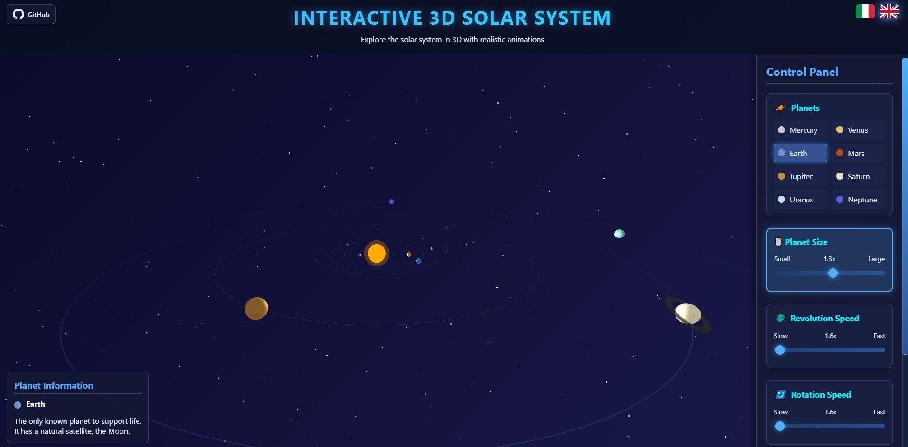

Welcome to the project!  
🔗 [Italiano (README.it.md)](README.it.md)

# 🌌 Interactive 3D Solar System
> An immersive experience to explore the solar system in 3D with realistic animations and interactive controls.

## 🚀 Key Features

### 🌍 Realistic 3D Visualisation

- **Advanced 3D rendering** with Three.js
- **Smooth animations** of planetary revolution and rotation
- **Starfield effect** background for a space atmosphere
- **Camera controls** OrbitControls for free navigation

### 🎮 Interactive Controls

- **Planet selection** via click
- **Dynamic sliders** to control:
  - 📏 Planet dimensions (0.5x - 2.0x)
  - 🌎 Revolution speed (0x - 100x)
  - 🔄 Rotation speed (0x - 100x)
- **Mouse wheel control** for quick adjustments
- **Pause/Resume** pauses or resumes animations
- **Reset** restores configuration
- **Reset View** restores camera view configuration

### 🌐 Multilingual System

- **Italiano** 🇮🇹
- **English** 🇬🇧

### 💾 Import/Export Configurations

- **JSON export** of custom configurations
- **Import** saved configurations
- **Automatic download** of JSON files
- **Copy to clipboard** with one click
- **Syntax highlighting** for JSON with Prism.js

### 📊 Planetary Information

- **Detailed information panel** for each planet
- **Accurate scientific data**
- **Realistic colours** for each celestial body
- **Emissive effects** to simulate illumination

## 📝 Design Notes

1. Upon page load, **the sizes of the planets** are scaled while maintaining their proportions relative to Earth.

2. To create a more visually pleasing experience, some proportions regarding distances — such as those between **Jupiter and the outer planets of the Solar System** — have not been preserved. For the same reason, neither the **Sun’s size** nor its distance has been represented accurately.

3. **Saturn’s rings** do not actually oscillate in this way, but the effect has been added to give the project a more playful tone.

## 🛠️ Technologies Used

- **Three.js** (v0.140.0) - 3D Rendering
- **OrbitControls** - Camera controls
- **Prism.js** - JSON syntax highlighting
- **CSS3** - Modern animations and styling
- **Vanilla JavaScript** - Application logic
- **HTML5** - Semantic structure

## 🏗️ Project Architecture
```
solar3daros/
├── index.html              # Main Page  
├── css/                    # Stylesheets  
│   ├── main.css            # Main Styles  
│   ├── controls.css        # UI Controls Styles  
│   ├── planets.css         # Planet List Styles  
│   ├── modal.css           # Modal Styles  
│   └── json.css            # Syntax Highlighting Styles  
├── js/                     # JavaScript Modules  
│   ├── config.js           # Configurations and Translations  
│   ├── planets-data.js     # Planet Scientific Data  
│   ├── solar-system.js     # 3D Rendering Logic  
│   ├── ui-controls.js      # User Interface Management  
│   ├── camera.js           # Camera Controls  
│   ├── import-export.js    # I/O Features  
│   └── modal.js            # Modal Management
```


## 🎯 Advanced Features

### 🎨 Visual Customisation

- **Individual scaling** of planets
- **Independent speed control** for each planet
- **Hover highlighting** on planets
- **Dynamic cursor** that changes on interactive elements

### ⚡ Performance

- **Optimised rendering** with requestAnimationFrame
- **Efficient memory management**
- **Responsive design** for all devices
- **Asynchronous loading** of resources

### 🔧 Configurability

- **Complete state saving** of the application
- **Custom configuration restoration**
- **Robust JSON validation**
- **User notifications** for immediate feedback

## 🚀 Getting Started

1. **Clone the repository**
2. **Open `index.html`** in a modern browser
3. **Explore the solar system** by clicking on planets
4. **Customise** settings with the controls
5. **Save** your preferred configurations

## 🎮 Controls

| Action | Control |
|--------|----------|
| **Rotate view** | Click + Drag |
| **Zoom** | Mouse Wheel (when no planet is selected) |
| **Select planet** | Click on planet (or on planet name) |
| **Modify properties** | Mouse Wheel (when planet selected) |
| **Pause/Resume** | Pause Button |
| **Reset** | Reset Button |
| **Reset view** | Reset Camera Button |

## 📱 Compatibility

- ✅ **Chrome** 90+
- ✅ **Firefox** 88+
- ✅ **Safari** 14+
- ✅ **Edge** 90+
- 📱 **Mobile** responsive

## 🎬 Demo

**Online Demo:** Try the live version here: [https://solar3-daros.vercel.app/](https://solar3-daros.vercel.app/)



## 🤝 Contributions

Contributions are welcome! Feel free to:
- 🐛 Report bugs
- 💡 Propose new features
- 🔧 Improve the code
- 📖 Improve documentation

## 👨‍💻 Author

**GitHub:** [daros](https://github.com/dariorosina)

## 📄 Licence

This project is released under the MIT licence.

---

**Developed with ❤️**